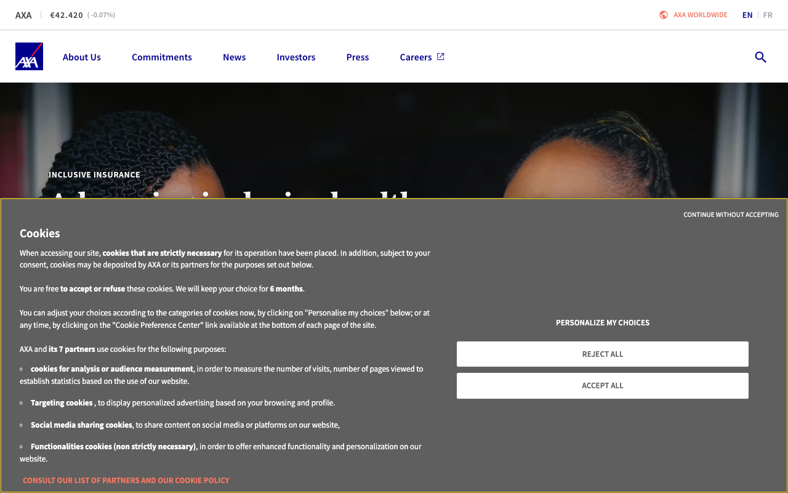

# Color Thief Report — 2026-04-21
*Companies analysed: AXA*

---

## AXA
**Website:** https://www.axa.com/

### Colour Palette

| Role | Hex | Notes |
|------|-----|-------|
| Primary | `#00008F` | AXA's iconic deep navy — dominant brand colour, appears on CTAs, logo, and interactive elements |
| Secondary | `#F07662` | Warm coral — used for links, CTA text, and hover states throughout |
| Tertiary | `#80A3A7` | Muted teal-grey — supporting accent, used sparingly for decorative elements |
| CTA / Action | `#F07662` | Coral confirmed as the primary action colour (link + button text) |
| Background | `#FFFFFF` | Clean white — generous use of white space throughout |
| Text | `#333333` | Dark grey body copy; headings use `#343C3D` (near-black with a warm teal undertone) |

> AXA pairs their historic deep navy (`#00008F`) — a colour they've owned for decades — with a fresh warm coral (`#F07662`) to balance authority with approachability. The palette reads as cool-dominant and trustworthy (fitting for insurance), with the coral doing the heavy lifting to add warmth and draw the eye to actions. Very minimal; the brand relies on colour restraint and white space rather than complexity.

---
